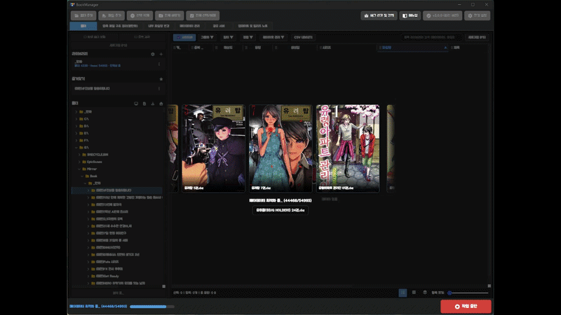
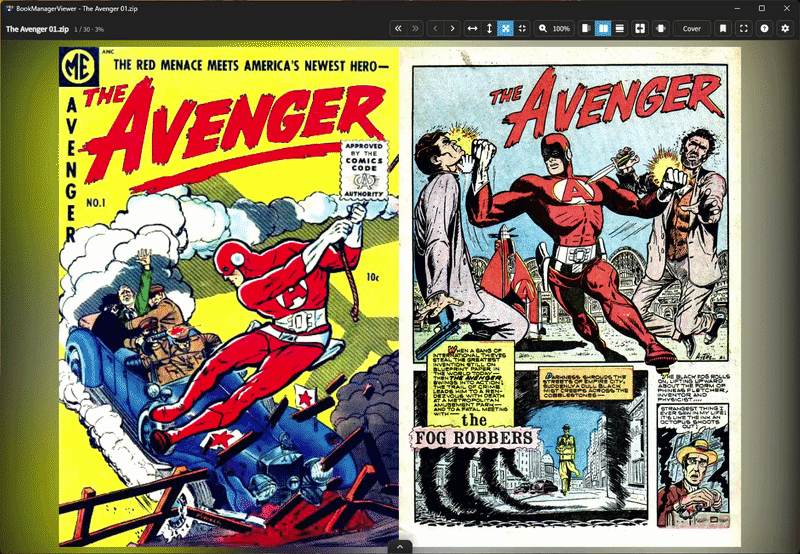

# BookManager

> The app supports Korean, English, and Japanese. This README and the [Wiki](https://github.com/dongkkase/BookManager/wiki) are written in Korean.

[](https://dongkkase.github.io/BookManager/)
[](https://discord.gg/DRVUbPewaV)
[](https://github.com/dongkkase/BookManager/releases)

BookManager는 만화책, 전자책, 텍스트 문서와 오디오북을 정리하고 읽는 Windows/macOS용 데스크톱 앱입니다. 컴퓨터, 외장하드와 NAS의 폴더를 라이브러리로 등록해 검색하고, 압축 파일 정리부터 메타데이터 편집, 내장 뷰어, 다른 기기와의 공유까지 한곳에서 처리할 수 있습니다.


## 설치 및 시작하기

1. [최신 릴리즈](https://github.com/dongkkase/BookManager/releases/latest)에서 운영체제에 맞는 파일을 내려받습니다.
2. Windows는 `BookManager-win.zip`을 풀고 `BookManager.exe`를 실행합니다. macOS는 `BookManager-mac.zip`을 풀고 `BookManager.app`을 실행합니다.
3. 환경 설정에서 책을 보관한 폴더를 라이브러리로 등록합니다. NAS는 컴퓨터에서 폴더로 접근할 수 있는 경로를 사용합니다.
4. `폴더` 탭에서 책을 탐색하거나 더블클릭해 내장 뷰어로 엽니다. 정리·편집할 파일은 해당 작업 탭으로 보내거나 파일·폴더를 끌어다 놓아 추가합니다.

| 항목 | 지원 범위 |
| --- | --- |
| Windows | x64 포터블 실행 파일 |
| macOS | Intel 및 Apple Silicon용 Universal 앱 |
| 앱 언어 | 한국어, 영어, 일본어 |

macOS에서 내려받은 앱이 격리 속성 때문에 열리지 않으면, 다운로드한 앱의 경로에 맞춰 다음 명령을 실행할 수 있습니다.

```bash
xattr -cr "$HOME/Downloads/BookManager.app"
open "$HOME/Downloads/BookManager.app"
```

## 지원 파일 형식

| 종류 | 라이브러리·뷰어 대상 형식 |
| --- | --- |
| 만화책 | ZIP, CBZ, RAR, CBR, 7Z, CB7 |
| 전자책·문서 | EPUB, PDF, TXT |
| 오디오북 | AAC, AIF/AIFF, FLAC, M4A/M4B, MP3, OGA/OGG/OPUS, WAV/WAVE, 3GP, AMR, CAF, WEBM |

파일을 읽는 기능과 정리·메타데이터 저장 기능의 지원 범위는 서로 다릅니다. 오디오 재생 가능 여부도 파일에 사용된 코덱에 따라 달라질 수 있습니다.

## 라이브러리 탐색과 검색

- 여러 라이브러리에 별칭과 그룹을 지정하고, 목록·타일·썸네일 보기로 탐색합니다.
- 표지와 메타데이터를 스캔해 캐시에 저장하고, 즐겨찾기와 최근 읽은 책을 관리합니다.
- 현재 폴더 또는 등록된 전체 라이브러리에서 파일명, 폴더명과 책 정보를 검색합니다.
- `#태그` 검색으로 장르, 태그, 작가, 출판사, 연도와 확장자 등의 조건을 조합합니다.
- 내용 검색 인덱스를 만들면 EPUB, PDF와 TXT의 본문으로 책을 찾을 수 있습니다. OCR이 필요한 스캔 PDF와 이미지형 EPUB은 본문 검색 대상에서 제외됩니다.
- 파일명과 권수 등의 숫자 정보를 비교해 중복 후보를 찾습니다. 파일 내용의 완전한 일치 여부를 검사하는 기능은 아닙니다.
- 시리즈별 권·화 번호를 분석해 중간에 빠진 번호를 확인합니다.
- 표시 항목과 레이아웃을 설정하고, 현재 목록을 CSV로 내보낼 수 있습니다.

## 만화책 압축 파일 정리

### 압축 파일 구조 정리

ZIP, CBZ, RAR, CBR와 7Z 파일을 추가해 내부 구조를 분석하고, 여러 권·화가 들어 있는 압축 파일을 나누거나 중첩된 폴더 구조를 평탄화합니다. 실행 전에 결과 파일명과 저장 위치를 확인할 수 있습니다.

예를 들어 하나의 ZIP 안에 `작품 001권/`, `작품 002권/` 폴더가 있으면, 각 권을 별도의 CBZ 파일로 나누어 정리할 수 있습니다.

### 내부 파일명 변경

- 압축 파일 안의 이미지와 기존·변경 예정 파일명을 나란히 확인합니다.
- 숫자, `Cover`, `Page`, 압축 파일명 또는 사용자 지정 문구로 이름 규칙을 설정합니다.
- 이미지 순서를 바꾸거나 불필요한 이미지를 제외하고, 빠진 페이지 번호를 확인합니다.
- 여러 파일에 같은 규칙을 적용하고, 이미지 용량 줄이기와 이미지 메타데이터 제거를 함께 수행할 수 있습니다.

원본 보관이 필요하면 작업 전에 환경 설정의 `원본 백업`을 켜세요. 정리한 파일과 `ComicInfo.xml`은 Kavita, Komga, YACReader, Panels 등 해당 형식을 지원하는 서버·뷰어에서 활용할 수 있습니다.

## 메타데이터 검색과 편집

만화책, EPUB, PDF, TXT와 오디오북의 제목, 시리즈, 권수, 작가, 출판사, 발행일, 장르, 태그와 설명 등을 편집합니다. 편집 항목과 저장 방식은 파일 종류에 따라 다릅니다.

- 통합검색 또는 개별 소스를 선택해 책 정보를 찾고, 검색 결과를 확인한 뒤 적용합니다.
- 만화책은 리디북스, 문피아, YES24, 알라딘, Google Books, AniList와 Comic Vine을 사용합니다.
- EPUB, PDF, TXT와 오디오북은 리디북스, 문피아, YES24, 알라딘, Google Books와 Amazon을 사용합니다.
- 파일명에서 제목·권수·화수를 추출하고, 같은 시리즈에 공통 정보를 일괄 적용하거나 기존 라이브러리의 책 정보를 재사용합니다.
- 표지 미리보기와 교체를 지원하며, 사용할 수 있는 표지 작업은 파일 형식에 따라 다릅니다.
- `AI 원제 찾기`로 표지에서 제목 후보를 찾거나 외국어 검색 결과를 번역할 수 있습니다.

일부 검색 소스와 AI 기능은 환경 설정에 별도의 API 키를 입력해야 합니다.

### 파일별 저장 방식

| 파일 형식 | 메타데이터 저장 방식 |
| --- | --- |
| ZIP, CBZ, 7Z | 압축 파일 내부의 `ComicInfo.xml`에 저장 |
| RAR, CBR | 메타데이터 읽기 지원, 원본 압축 파일에 직접 저장은 미지원 |
| EPUB | EPUB 내부 메타데이터와 표지 갱신 |
| PDF | PDF 내부 메타데이터 갱신 |
| TXT | 원본 본문을 바꾸지 않고 앱 DB에 책 정보를, 별도 폴더에 표지를 저장 |
| 쓰기 지원 오디오북 | 실제 오디오 파일의 태그와 임베디드 앞표지 갱신 |

ZIP과 CBZ는 가능한 경우 전체 압축을 풀고 다시 압축하지 않고 `ComicInfo.xml`만 갱신합니다. 저장한 메타데이터를 다른 앱에서 표시하는 범위는 해당 앱의 지원 규격에 따라 달라집니다.

오디오북의 태그·표지 저장은 AAC, AIF/AIFF, FLAC, M4A/M4B, MP3, OGA/OGG/OPUS, WAV/WAVE에서 지원합니다. 3GP, AMR, CAF, WEBM은 분석만 지원합니다. 재생 시간, 비트레이트, 샘플레이트, 코덱 등의 기술 정보는 분석해 표시하며 편집하지 않습니다.

TXT 메타데이터는 파일 전체 내용의 SHA-256 해시로 연결됩니다. 이름이나 경로가 바뀌어도 다시 추가하거나 스캔하면 저장된 정보와 표지가 연결되고, 내용이 같은 복사본은 정보를 공유합니다. 본문이나 인코딩이 달라지면 별개 파일로 취급하므로 텍본 정리기로 저장한 파일도 이에 해당합니다.

## 내장 뷰어와 오디오북 재생

- 만화책, EPUB, PDF, TXT와 오디오북을 내장 뷰어에서 엽니다.
- 문서 종류에 맞춰 한 장·두 장 보기, 스크롤, 확대·축소와 전체 화면을 사용합니다.
- 페이지 전환 효과, 읽기 테마와 페이지 색을 반영하는 배경을 설정합니다.
- EPUB, PDF와 TXT 안에서 내용을 검색하고 해당 위치로 이동합니다.
- 책갈피와 마지막 읽은 위치를 저장합니다.
- 만화책, EPUB, PDF와 TXT는 형식별 외부 뷰어를 지정할 수도 있습니다.

EPUB과 TXT는 TTS로 들을 수 있습니다. 시스템 음성, 선택 설치하는 로컬 Supertonic 3 모델, OpenAI와 Google Cloud TTS를 지원합니다. 로컬 모델은 최초 다운로드가 필요하며 설치 후 기기에서 음성을 생성합니다. 외부 TTS는 별도 인증 정보가 필요하고, Google Cloud TTS에는 서비스 계정 JSON 또는 해당 파일 경로를 설정합니다.

오디오북 플레이어에서는 재생 속도, 앞뒤 이동, 음량, 북마크, 재생목록·연속 재생과 취침 타이머를 사용할 수 있습니다. 미니 플레이어로 전환해 다른 작업 중에도 재생할 수 있습니다.

## 파일 도구와 텍본 정리기

`파일 도구` 탭에서 텍본 정리기를 열거나 압축 파일 구조 정리, 내부 파일명 변경, 메타데이터 관리로 이동할 수 있습니다.

현재 텍본 정리기는 다음 작업을 지원합니다.

- 최대 128MB의 TXT 파일 한 개를 열거나 끌어다 놓기
- UTF-8, UTF-16 LE/BE, EUC-KR(CP949 계열), Shift-JIS 인코딩 판별
- 행 앞의 공백·탭 제거, 연속 공백 정리, 문장 중간 개행 후보 연결
- 표, 탭 구분 행, 구분선과 코드 블록 등의 구조를 보호하며 분석
- 원본·결과 비교, 변경된 줄 탐색, 결과 직접 편집

저장할 때 원본 바이트는 `<원본명>.bak.txt`로 보관하고, 결과는 원본 파일명에 UTF-8 BOM으로 저장합니다. 기존 백업이 있으면 타임스탬프 이름으로 보관하며, 파일을 연 뒤 외부에서 원본이 변경된 경우 저장을 중단합니다. 문장 연결은 규칙 기반이므로 시·가사처럼 개행 자체에 의미가 있는 내용은 결과를 확인한 뒤 저장하세요.

인코딩 변환 전용 도구, 텍스트 분할·병합, TXT 변환, 이미지 리사이저·AI 업스케일러, PDF 분할·병합과 OCR 등 `준비 중`으로 표시되는 도구는 아직 사용할 수 없습니다.

## 공유 서버와 Readive 연동

등록한 라이브러리를 같은 네트워크의 스마트폰, 태블릿과 다른 컴퓨터에서 이용할 수 있습니다.

| 방식 | 용도 |
| --- | --- |
| OPDS | 지원하는 전자책 앱에서 책 목록 탐색과 다운로드 |
| Web | 웹 브라우저에서 라이브러리 탐색 |
| WebDAV | ComicGlass 등 WebDAV 지원 앱에서 파일 접근 |
| Readive 연동 | 등록한 모바일 기기로 파일 전송 및 Readive에서 라이브러리 탐색·가져오기 |

`공유 서버` 탭에서 네트워크 주소와 포트를 선택해 서버를 시작합니다. WebDAV는 아이디·비밀번호를 설정할 수 있으며, HTTPS를 사용할 경우 자체 서명 인증서를 기기에서 허용해야 할 수 있습니다.

[Readive](https://dongkkase.github.io/BookManager/readive/)는 QR 코드로 기기를 등록하거나 IP·포트를 직접 입력하고 양쪽 화면의 확인 코드를 대조해 연결합니다. 연결한 기기의 저장 위치를 골라 선택한 파일·폴더를 전송하고 진행 상태를 확인할 수 있습니다.

공유·전송 중에는 BookManager와 해당 서버 또는 연동 기능이 실행 중이어야 합니다. 연결되지 않으면 같은 네트워크에 있는지와 방화벽·포트 설정을 확인하세요.

## 데이터 보관과 백업

배포 앱은 실행 파일 옆의 `BookManagerData` 폴더에 설정과 라이브러리 데이터를 저장합니다. macOS에서는 `.app` 내부가 아닌 앱이 들어 있는 폴더를 기준으로 합니다.

- 설정, 라이브러리 정보와 표지 등을 함께 보관하려면 앱을 종료한 뒤 `BookManagerData` 폴더를 백업합니다.
- TXT의 책 정보와 표지는 `BookManagerData/library.db`와 `BookManagerData/text-thumbnails`에 저장되므로 함께 보관해야 합니다.
- 실제 책 파일은 라이브러리로 등록한 원래 경로에 있습니다. 앱 데이터 백업과 별도로 보관해야 합니다.
- 압축 파일 정리나 메타데이터 저장은 실제 파일을 변경할 수 있습니다. 환경 설정의 `원본 백업`과 텍본 정리기의 `.bak.txt` 백업은 별개의 기능입니다.


## 사용 예시

아래 GIF는 압축 파일 정리 작업의 예시이며, 현재 버전의 화면과 차이가 있을 수 있습니다.

<kbd></kbd>
<kbd></kbd>

## 도움말과 라이선스

- [프로젝트 소개](https://dongkkase.github.io/BookManager/)
- [사용 설명서 · Wiki](https://github.com/dongkkase/BookManager/wiki)
- [오류 제보 · 기능 요청](https://github.com/dongkkase/BookManager/issues)
- [Discord](https://discord.gg/DRVUbPewaV)

BookManager는 [MIT 라이선스](LICENSE)로 공개됩니다. 포함된 라이브러리와 모델의 라이선스는 [서드파티 고지](THIRD_PARTY_NOTICES.md)를 참고하세요. 외부 검색·AI·TTS 서비스를 사용할 때는 해당 서비스의 이용 조건과 요금이 적용될 수 있습니다.
