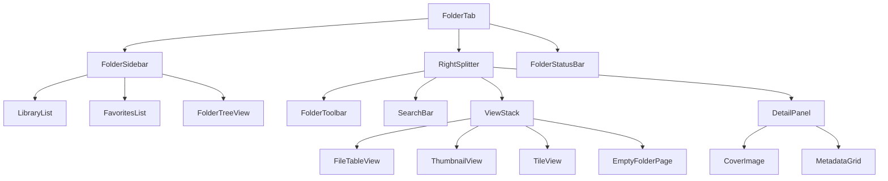

# Phase 6-2: 폴더 탭 (Tab0) UI 구현 계획

## 1. Python 원본 UI 구조 분석

### 1.1 메인 레이아웃 (`tab_folder.py`)

```
TabFolder (QWidget - 4867줄)
│
├── QVBoxLayout (메인 레이아웃)
│   │
│   ├── QSplitter (Horizontal) - 메인 분할 레이아웃
│   │   │
│   │   ├── Left Panel (최대 400px, 최소 200px)
│   │   │   ├── QListWidget - 라이브러리 목록 (list_libraries)
│   │   │   ├── QListWidget - 즐겨찾기 목록 (list_favorites)
│   │   │   └── QTreeView - 폴더 트리 뷰 (tree_view)
│   │   │       └── QFileSystemModel 기반
│   │   │
│   │   └── Right Splitter (Vertical)
│   │       │
│   │       ├── Top Section (flex: 1)
│   │       │   ├── QHBoxLayout - 툴바
│   │       │   │   ├── 그룹화 버튼 (btn_grouping)
│   │       │   │   ├── 필터 버튼 (btn_filter)
│   │       │   │   ├── 정렬 버튼 (btn_sort)
│   │       │   │   ├── 뷰 모드 토글 (btn_view_detail/thumbnail/tile)
│   │       │   │   ├── 하위폴더 포함 토글 (btn_subfolders)
│   │       │   │   └── 중복검사 토글 (btn_dup_check)
│   │       │   │
│   │       │   ├── SearchBar - 검색 바
│   │       │   │
│   │       │   └── QStackedWidget - 뷰 모드 스택
│   │       │       ├── CustomTableView + LibraryTableModel (Detail 뷰)
│   │       │       ├── QListView + FileListModel (Thumbnail 뷰)
│   │       │       └── EmptyFolderPage (빈 폴더)
│   │       │
│   │       └── Bottom Section (최대 350px) - DetailBackgroundWidget
│   │           ├── Cover Image (좌측)
│   │           └── Metadata Grid (우측) - QFormLayout
│   │
│   └── StatusBar
│       ├── 진행바 (progress_bar)
│       └── 상태 메시지 (status_label)
```

### 1.2 데이터 모델 (`tab_folder_models.py`)

| 모델 | 역할 |
|------|------|
| `LibraryTableModel` | 파일 테이블 데이터 (30+ 컬럼) |
| `ThumbnailDelegate` | 썸네일 컬럼 델리게이트 |
| `FileListModel` | 아이콘/타일 뷰 데이터 |
| `FolderTreeModel` | 폴더 트리 구조 |

### 1.3 백그라운드 스레드 (`tab_folder_threads.py`)

| 스레드 | 역할 |
|--------|------|
| `FolderScanThread` | 폴더 스캔 → file_data_cache |
| `DupScanThread` | 중복 검사 대상 폴더 스캔 |
| `DupMatchThread` | Bigram 기반 유사도 매칭 |
| `MemoryExtractThread` | ComicInfo.xml 파싱, 썸네일 추출 |

### 1.4 커스텀 UI 위젯 (`tab_folder_ui.py`)

| 위젯 | 역할 |
|------|------|
| `GlowCard` | 반투명 카드 배경 + glow 효과 |
| `FlowLayout` | 태그용 흐름 레이아웃 |
| `DetailBackgroundWidget` | 상세 정보 패널 배경 |

---

## 2. React 컴포넌트 아키텍처

### 2.1 파일 구조

```
src/
├── tabs/
│   └── FolderTab.jsx                    # 메인 컨테이너
├── components/
│   ├── folder/
│   │   ├── FolderSidebar.jsx            # 좌측 사이드바
│   │   ├── FolderToolbar.jsx            # 상단 툴바
│   │   ├── FileTableView.jsx            # 테이블 뷰
│   │   ├── ThumbnailView.jsx            # 썸네일 뷰
│   │   ├── TileView.jsx                 # 타일 뷰
│   │   ├── DetailPanel.jsx              # 하단 상세 패널
│   │   ├── SearchBar.jsx                # 검색 바
│   │   └── FolderStatusBar.jsx          # 상태 바
├── hooks/
│   ├── useFolderScan.js                 # 폴더 스캔 훅
│   └── useFileSelection.js              # 파일 선택 상태 훅
└── styles/
    └── FolderTab.css                    # 폴더 탭 전용 스타일
```

### 2.2 컴포넌트 계층도



### 2.3 상태 관리 설계

| 상태 | 타입 | 초기값 | 설명 |
|------|------|--------|------|
| `selectedFolderPath` | `string` | `''` | 현재 선택된 폴더 경로 |
| `fileDataCache` | `Array` | `[]` | 파일 데이터 캐시 |
| `viewMode` | `'detail' \| 'thumbnail' \| 'tile'` | `'detail'` | 현재 뷰 모드 |
| `sortKey` | `string` | `'name'` | 정렬 키 |
| `sortOrder` | `'asc' \| 'desc'` | `'asc'` | 정렬 순서 |
| `groupKey` | `string` | `'none'` | 그룹화 키 |
| `includeSubfolders` | `boolean` | `true` | 하위 폴더 포함 |
| `enableDupCheck` | `boolean` | `false` | 중복 검사 활성화 |
| `searchQuery` | `string` | `''` | 검색어 |
| `selectedFiles` | `Set` | `new Set()` | 선택된 파일 인덱스 |
| `selectedFileData` | `object \| null` | `null` | 선택된 파일 상세 데이터 |
| `scanning` | `boolean` | `false` | 스캔 진행 중 |
| `scanProgress` | `number` | `0` | 스캔 진행률 |
| `statusMessage` | `string` | `''` | 상태 메시지 |
| `libraries` | `Array` | `[]` | 라이브러리 목록 |
| `favorites` | `Array` | `[]` | 즐겨찾기 목록 |

---

## 3. i18n 번역 키 구조

### 3.1 추가 필요한 키

```javascript
folder: {
  // 툴바
  toolbar: {
    group_by: '그룹화',
    sort_by: '정렬',
    view_detail: '상세',
    view_thumbnail: '썸네일',
    view_tile: '타일',
    include_subfolders: '하위 폴더 포함',
    dup_check: '중복 검사',
    refresh: '새로고침',
    search: '검색',
  },
  // 사이드바
  sidebar: {
    libraries: '라이브러리',
    favorites: '즐겨찾기',
    folders: '폴더',
    add_library: '라이브러리 추가',
    remove_library: '라이브러리 제거',
    add_favorite: '즐겨찾기에 추가',
    remove_favorite: '즐겨찾기에서 제거',
  },
  // 테이블 컬럼
  columns: {
    cover: '커버',
    name: '이름',
    size: '크기',
    resolution: '해상도',
    modified: '수정일',
    series: '시리즈',
    title: '제목',
    volume: '권',
    issue: '화',
    writer: '작가',
  },
  // 상태 메시지
  status: {
    scanning: '폴더 스캔 중...',
    scanning_progress: '스캔 진행률: {progress}%',
    files_found: '{count}개 파일 발견',
    no_files: '파일이 없습니다',
    empty_folder: '폴더가 비어 있습니다',
  },
  // 상세 패널
  detail: {
    metadata: '메타데이터',
    no_selection: '파일을 선택하세요',
  },
}
```

---

## 4. 구현 순서 및 단계

### 단계 1: i18n 번역 키 추가
- [`electron/utils/i18n.js`](electron/utils/i18n.js:1)에 `folder.*` 관련 키 추가
- 한국어/영어 번역 모두 포함

### 단계 2: FolderTab.css 스타일 파일 생성
- Python 원본의 [`DetailBackgroundWidget`](old_project/ComicZIP_Optimizer/ui/tabs/tab_folder_ui.py:1) 스타일 포트
- 3패널 레이아웃 스타일 정의
- 테이블, 썸네일, 타일 뷰 스타일

### 단계 3: 서브 컴포넌트 생성
1. **FolderSidebar.jsx** - 좌측 사이드바
   - 라이브러리 목록
   - 즐겨찾기 목록
   - 폴더 트리 뷰 (재귀 렌더링)
2. **FolderToolbar.jsx** - 상단 툴바
   - 그룹화, 필터, 정렬 버튼
   - 뷰 모드 토글
3. **FileTableView.jsx** - 테이블 뷰
   - 컬럼 헤더 + 정렬
   - 행 선택
4. **ThumbnailView.jsx** - 썸네일 그리드 뷰
5. **TileView.jsx** - 타일 뷰
6. **DetailPanel.jsx** - 상세 정보 패널
   - 커버 이미지
   - 메타데이터 그리드
7. **SearchBar.jsx** - 검색 바

### 단계 4: FolderTab.jsx 메인 통합
- 상태 관리 (useState/useReducer)
- 서브 컴포넌트 조립
- IPC 호출 연동 (폴더 스캔 등)

### 단계 5: 상태 관리 훅 생성
- `useFolderScan.js` - 폴더 스캔 상태 관리
- `useFileSelection.js` - 파일 선택 상태 관리

---

## 5. IPC 연동 계획

### 5.1 필요 IPC 채널

| 채널 | 방향 | 데이터 |
|------|------|--------|
| `folder:scan` | Renderer → Main | `{ path, includeSubfolders, dupCheck }` |
| `folder:scan:progress` | Main → Renderer | `{ progress, message }` |
| `folder:scan:complete` | Main → Renderer | `{ files: FileData[] }` |
| `folder:get-libraries` | Renderer → Main | `-` |
| `folder:add-library` | Renderer → Main | `{ path }` |
| `folder:remove-library` | Renderer → Main | `{ path }` |
| `folder:get-favorites` | Renderer → Main | `-`` |
| `folder:add-favorite` | Renderer → Main | `{ path }` |
| `folder:extract-metadata` | Renderer → Main | `{ filePath }` |
| `folder:get-thumbnail` | Renderer → Main | `{ filePath }` |

---

## 6. CSS 스타일 전략

### 6.1 기존 CSS 변수 활용
- `--bg-primary`, `--bg-secondary`, `--bg-tertiary` - 배경색
- `--accent-primary`, `--accent-hover` - 강조색
- `--border-color`, `--border-light` - 테두리
- `--text-primary`, `--text-secondary` - 텍스트

### 6.2 새로 추가할 CSS 변수
```css
:root {
  --folder-sidebar-width: 300px;
  --folder-detail-height: 300px;
  --folder-thumbnail-size: 80px;
  --folder-tile-size: 120px;
}
```

---

## 7. Python → React 매핑 요약

| Python (PyQt6) | React |
|----------------|-------|
| `QWidget` | `div` |
| `QVBoxLayout`, `QHBoxLayout` | `display: flex` |
| `QSplitter` | `resize` 이벤트 + flex |
| `QListWidget` | `ul > li` |
| `QTreeView` | 재귀 `ul > li` 컴포넌트 |
| `QTableView` + `QAbstractTableModel` | `table` + 상태 배열 |
| `QStackedWidget` | 조건부 렌더링 |
| `QThread` | Worker threads / async |
| `QFileSystemModel` | Node.js `fs` + IPC |
| `QSignal/QSlot` | React hooks / callbacks |
| `QFormLayout` | `div` + flex |
| `QLabel` | `img`, `span` |
| `QProgressBar` | `div` + width |

---

## 8. 주의사항

1. **성능**: 대량 파일 렌더링 시 가상화 고려 (react-window 등)
2. **썸네일**: WebP 캐싱 + lazy loading
3. **트리 뷰**: 폴더가 깊을 때 재귀 렌더링 최적화
4. **메모리**: ComicInfo.xml 파싱은 백그라운드에서
5. **IPC**: 대용량 데이터 전송 시 chunking 고려
